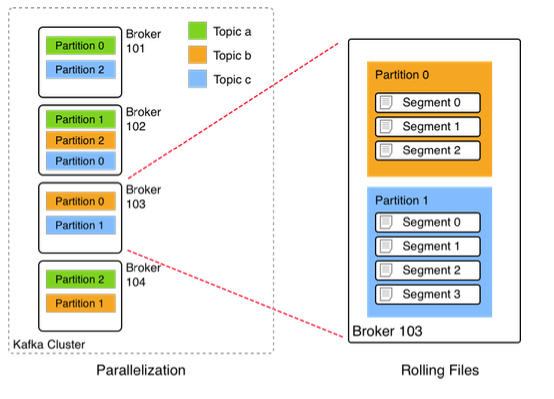

# Broker kafka
Un cluster de kafka está compuesto por uno o varios brokers, que son los encargados de almacenar y distribuir los mensajes. Cada broker es un servidor independiente que forma parte de un cluster.
Los brokers almacenan los mensajes de forma temporal en un buffer de escritura (page cache) y de forma persistente en disco tras flushear el buffer (log segment).

## Topicos
Los mensajes se organizan de forma lógica en tópicos, serían el equivalente a colas de mensajería salvando algunas diferenicias que comentamos más adelante. Los productores y consumidores se configuran a nivel de tópico a la hora de envíar o recibir mensajes.

## Particiones
Los tópicos a su vez se dividen en particiones, que son las unidades de paralelismo de la consumición. Los mensajes del tópico estarán repartidos entre las particiones, la elección de a que partición va cada mensaje la realiza el productor en función de un algoritmo de particionado.

## Segmentos
Los tópicos se componen de varios segmentos, que son los ficheros en los que se almacenan los mensajes. Siempre hay un segmento activo que es en el que se están persistiendo los mensajes que están entrando en el momento acutal. 
Los segmentos tienen un tamaño máximo configurable y cuando se alcanza se crea un nuevo segmento. Los segmentos se van eliminando cuando se alcanza el tiempo/tamaño de retención configurado.

## [VOLVER](readme.md)