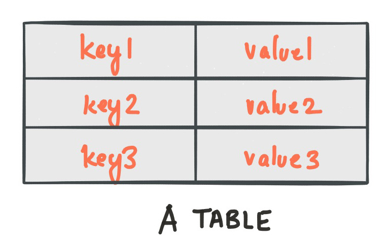
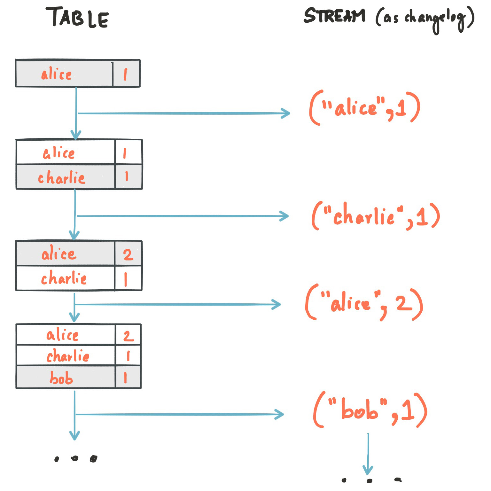
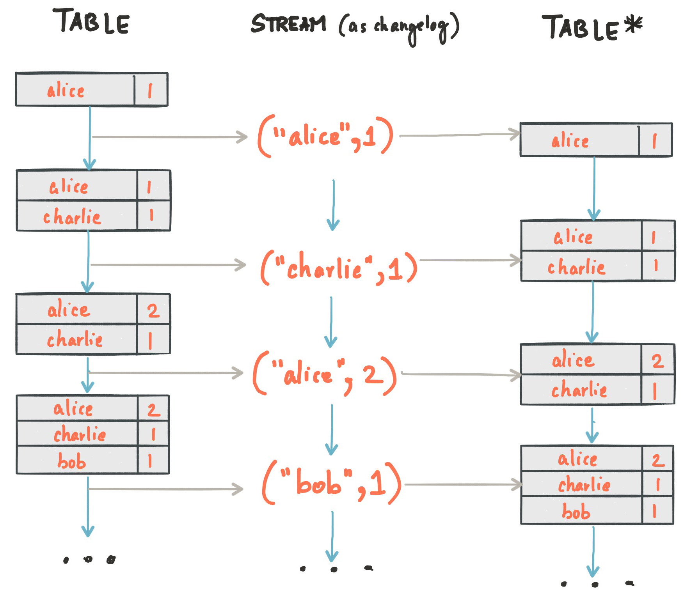

# KAFKA STREAMS DSL

Kafka streams DSL es un API de alto nivel que proporciona las operaciones comunes de transformación, como map, filter, join, etc.

## STREAMS Y TABLAS

La API de Kafka Streams dispone de tres tipos de abstracciones principales para streams y tablas: KStream, KTable y GlobalKTable.

Estas abstracciones son objetos disponibles en la API y nos permiten realizar distintas operaciones sobre datos de entrada.

### KStream
Un KStream es una abstracción de un flujo de registros, en el que cada registro de datos representa un dato autónomo en un conjunto de datos ilimitado. 

### KTable
Una KTable es una abstracción de un flujo de registro de cambios, donde cada registro de datos representa una actualización. Más concretamente, el valor de un registro de datos se interpreta como una "ACTUALIZACIÓN" del último valor de la misma clave de registro, si existe (si aún no existe la clave correspondiente, la actualización se considerará una INSERTACIÓN). Utilizando la analogía de la tabla, un registro de datos en un flujo de cambios se interpreta como un UPSERT aka INSERT/UPDATE porque se sobrescribe cualquier fila existente con la misma clave. Además, los valores nulos se interpretan de un modo especial: un registro con un valor nulo representa un "DELETE" o borrado de la clave del registro.

### GlobalKTable
Al igual que una KTable, una GlobalKTable es una abstracción de un flujo de registro de cambios, donde cada registro de datos representa una actualización.
La GlobalKTable almacena registros de todas las particiones del tópico.

Si lees el tópico de entrada en una KTable, entonces la instancia "local" de KTable de cada instancia de aplicación se llenará con datos de sólo 1 partición de las 5 particiones del tópico.
Si lees el tópico de entrada en un GlobalKTable, entonces la instancia local de GlobalKTable de cada instancia de aplicación se rellenará con datos de todas las particiones del tópico.

Ventajas de las tablas globales:

- Puede utilizar tablas globales para "difundir" información a todas las instancias en ejecución de su aplicación.
- Las tablas globales permiten realizar uniones tipo one-to-many.
- Las tablas globales son más eficientes cuando se encadenan múltiples uniones.
Cuando se realiza una unión contra una tabla global, los datos de entrada no necesitan ser co-particionados.
- Las tablas globales admiten búsquedas de "claves ajenas", lo que significa que puede buscar datos en la tabla no sólo por la clave del registro, sino también por los datos de los valores del registro. En este caso, la unión siempre utiliza la clave primaria de la tabla, y la "clave ajena" se refiere a los registros de flujo. A diferencia de una unión de tabla, que siempre calcula la unión basándose en la clave del registro, una unión de tabla global permite extraer la clave de unión directamente del valor del registro.

Los inconvenientes de las tablas globales son:

- Mayor consumo de almacenamiento local en comparación con la KTable (particionada), porque se rastrea todo el tópico.
- Mayor carga de la red y del broker Kafka en comparación con la KTable (particionada), porque se lee todo el tópico.

### Dualidad de streams y tablas

Tomando como ejemplo una base de datos entendida como un par clave-valor, podríamos tomar el siguiente caso:

La dualidad stream-tabla consistiría en lo siguiente:

* Stream como tabla: Un stream se puede considerar un changelog de una tabla, donde cada registro muestra un cambio en el valor de una determinada clave. Por ello, podríamos regenerar el estado de la tabla.
* Tabla como stream: Una tabla puede considerarse una foto en un instante temporal. Si tomamos una foto cada instante, estos datos se vuelven un stream.

Dada esta dualidad la API de Kafka Streams permite realizar operaciones de transformación entre streams y tablas. Podemos transformar un KStream en un KTable si solo estamos interesados en el último valor de una clave, o un KTable en un KStream si queremos ver todos los cambios de una clave.

### Resumen

| KStream                             | KTable                              | GlobalKTable                        |
|:------------------------------------|:------------------------------------|:------------------------------------|
| Immutable                           | Mutable                             | Mutable                             |
| Insert(append)                      | Insert/Update/Delete                | Insert/Update/Delete                |
| Muchos eventos/key                  | 1 evento/key                        | 1 evento/key                        |
| Particionada                        | Particionada                        | NO Particionada                     |
| Garantizado el orden por partición  | Orden no garantizado por partición  | Orden no garantizado por partición  |

[Más información sobre streams y tablas](https://www.confluent.io/blog/streams-tables-two-sides-same-coin/)

[Más información sobre streams y tablas](https://www.confluent.io/blog/streams-tables-two-sides-same-coin/)

## [VOLVER](readme.md)