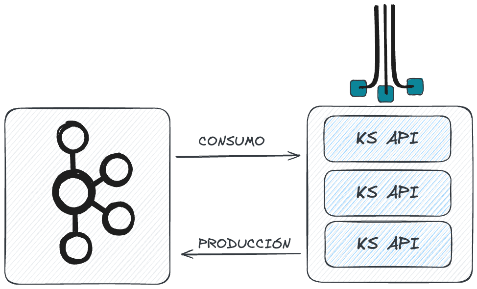
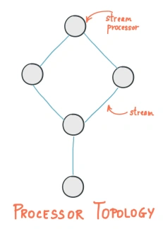
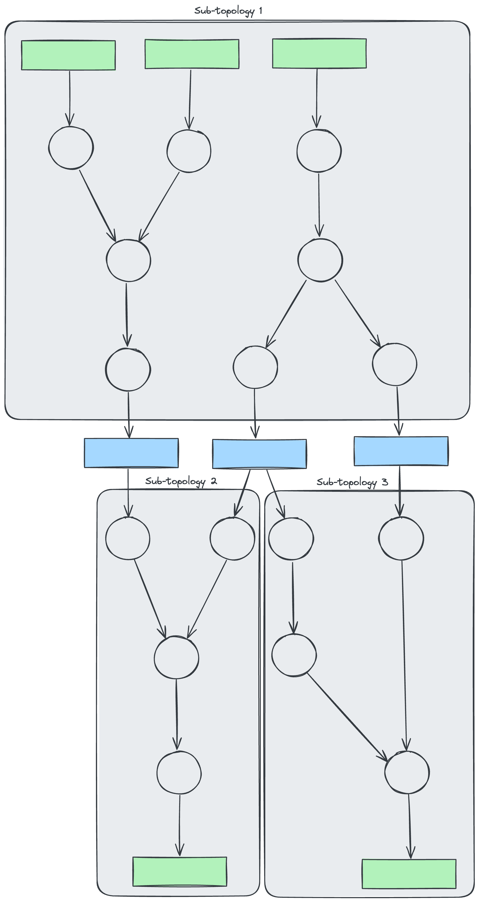

## KAFKA STREAMS INTRO

El API de Kafka Streams está disponible como una librería que permite construir aplicaciones distribuidas, altamente escalables, dinámicas y tolerantes a fallos.
Principalmente, permite crear aplicaciones de procesamiento en tiempo real, donde la información de entrada y de salida se almacena en un cluster de Kafka.

>  [Más información acerca de los coneptos básicos de Kafka streams](https://docs.confluent.io/platform/current/streams/concepts.html)
### ARQUITECTURA

Uno de los requisitos de esta tecnología es que pueda escalar horizontalmente, esto se consigue gracias a la capacidad de paralelizar la ejecución de tareas en diferentes máquinas.

Kafka Streams utiliza los conceptos de particiones de streams y tareas de streams como unidades lógicas en su modelo de paralelismo. Existen vínculos estrechos entre Kafka Streams y Kafka en el contexto del paralelismo:

* Cada partición de Streams es una secuencia totalmente ordenada de registros de datos que se asignan a una partición de un topic Kafka
* Un registro de datos en el stream se mapea a un mensaje Kafka de ese topic
* La key determina la partición donde van los datos, tanto para topics como para streams

Una topología de procesador de aplicación escala dividendo el input en múltiples tareas de streams. Más específicamente, Kafka Streams crea un número fijo de tareas en función de las particiones del stream de entrada, a cada tarea se le asigna un conjunto de particiones del input stream. La asignación de las particiones a las tareas del stream nunca cambia, por lo tanto la tarea de streams es una unidad fija de paralelismo de la aplicación.

Las tareas pueden crear instancias de su propia topología en función de las particiones asignadas. También mantiene un búfer para cada una de las particiones asignadas y procesa los datos de entrada uno a uno del bufer. Como resultado las tareas de stream se pueden procesar de forma independiente y en paralelo sin intervención manual.

Simplificando un poco, el máximo paralelismo que una aplicación puede tener está determinado por el numero máximo de tareas de stream, que a su vez viene determinado por el número máximo de particiones del topic del que se lea. Por ejemplo si el topic tiene 5 particiones, entonces puedes correr 5 instancias de aplicación.  Estas instancias van a colaborar para procesar los datos del topic, si corres más instancias que particiones, las instancias restantes estarán en idle hasta que alguna de las instancias en ejecución se caiga.

### TOPOLOGÍA

Una topología de procesador define la lógica computacional del procesamiento de datos que necesita ser realizado por la aplicación de streams. Una topología es un grafo en el que los nodos son los Stream Processors que están conectado por los streams representados por líneas.

### STREAM PROCESSOR

Es representado por los nodos en los grafos de tipología de procesador. Representa un paso de procesamiento en la topología, normalmente utilizado para transformar los datos, como filtrar, hacer uniones, agregaciones, transformaciones, etc.
Un stream processor recibe un registro en un momento del tiempo por el elemento anterior en el grafo, aplica la operación definida sobre el registro y produce uno o más registros como salida que es enviado al siguiente elemento del grafo.

### HILOS Y TAREAS

Kafka Streams permite al usuario configurar el número de hilos que una librería puede utilizar para paralelizar el procesamiento dentro de una instancia de aplicación. Cada hilo puede ejecutar una o más tareas de streams de su topología de procesador de forma independiente.

### STATE STORE

Kafka Streams proporciona lo que son llamados «Almacenes de estado», las aplicaciones utilizan estos almacenes para guardar y consultar datos, que es una característica importante cuando se realizan operaciones Stateful. El DSL de Kafka Streams, por ejemplo, automáticamente crea y maneja almacenes de estado cuando se llama a la operación count() o aggregate(), o cuando se realiza una ventana sobre un stream.

Cada tarea en una aplicación Kafka Stream puede tener uno o más almacenes de esado locales, necesarios para almacenar y consultar datos durante el procesamiento. Estos almacenes pueden ser una base de datos RocksDB, o un hashmap en memoria, etc. Kafka Streams ofrece tolerancia a fallos y recuperación automática de errores para los almacenes de estado locales.

### SUB TOPOLOGÍAS
Una sub-topología es un grupo de procesadores, que están conectados como padre/hijo o vía state stores en la topología.

Se establece una sub-topología cuando un grupo de nodos de procesado no tiene dependencia directa con sus antecesores o su comunicación con ellos es mediate tópicos internos.

Cada tarea puede instanciar sólo una de estas sub-topologías para su procesamiento. Esto amplía aún más la carga de trabajo computacional a múltiples tareas. 

>  [Más información sobre la arquitectura](https://docs.confluent.io/platform/current/streams/architecture.html)

## [VOLVER](kstreams)