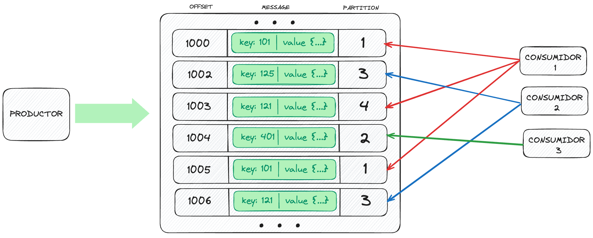
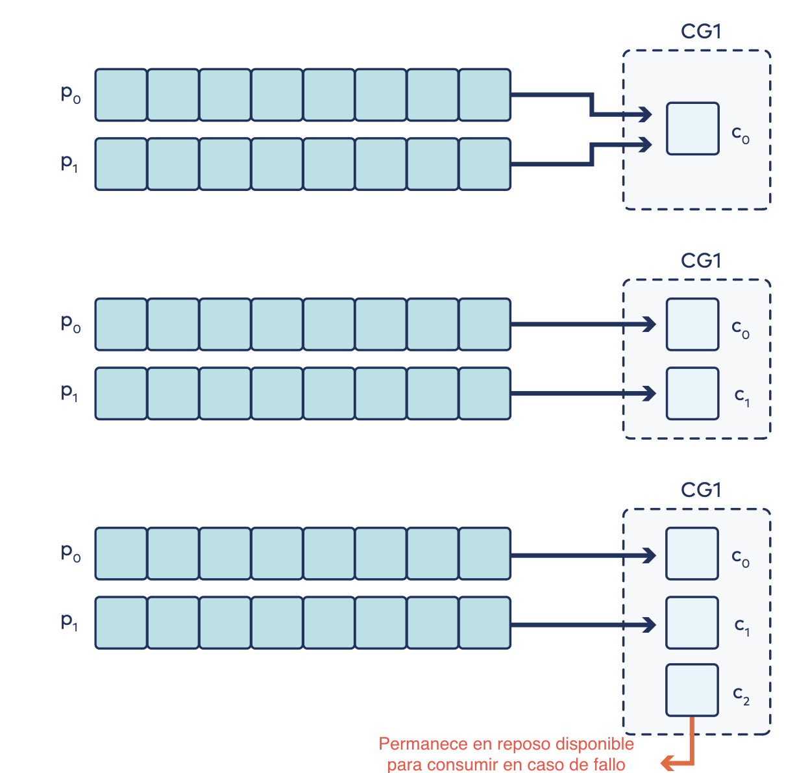
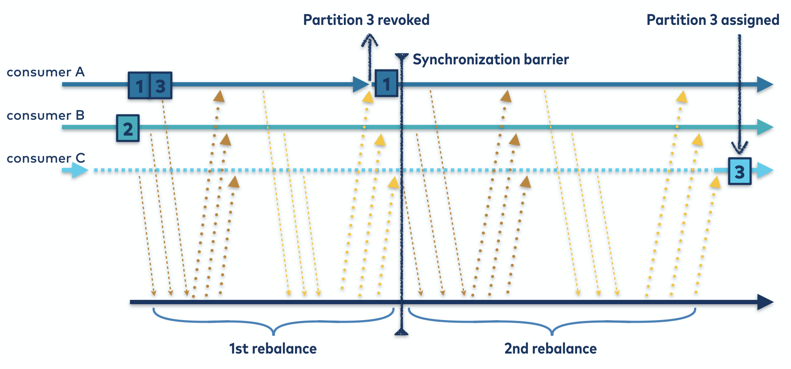

# CICLO DE VIDA DE LOS MENSAJES - PRODUCCIÓN

Los consumidores son los encargados de leer los mensajes y son gestionados por consumers groups.
Los consumidores se suscriben a tópicos, y se les asignan particiones de forma que cada partición sea consumida exclusivamente por un consumidor de cada consumer group, aunque un mismo consumidor puede consumir de varias particiones. 

Vemos en las siguientes imágenes distintos ejemplos de asignación de particiones a distintos números de consumidores, para un mismo consumer group.

Un consumer group es una serie de consumidores que se suscriben a una serie de tópicos, de forma que consumen cada uno de ellos en grupo.
Las particiones de cada tópico se dividen entre los consumidores del grupo, por lo que la unidad de paralelismo de la consumición es la partición.
Por tanto, como máximo podrá existir un consumidor asignado a cada partición por cada consumer group, quedando sin asignar aquellos que superen el número de particiones.

Existen distintas estrategias de asignación de particiones a cada consumidor:
- Range assignor (default): (particiones) / (consumidores). Se asignan las particiones a cada consumidor, teniendo como objetivo asignar el mismo número de particiones a cada consumidor.
- Round-robin assignor: Las particiones se asignan a los consumidores en orden secuencial, cuando se agotan todos los consumidores pero quedan particiones sin asignar, se vuelven a asignar empezando por el primer consumidor. El objetivo es maximizar el número de consumidores utilizados.
- Sticky assignor: Es una aproximación similar al Round Robin, pero preservando las máximas asignaciones posibles cuando se realiza una reasignación de particiones. El objetivo es evitar por completo el movimiento de particiones durante el reajuste.
- CooperativeSticky: Es un método muy similar al sticky, pero rebalancea consecutivamente. Se asigna un coordinador del grupo de consumidores que es responsable de las particiones de los tópicos suscritos y de los miembros del grupo. Ante un cambio, reacciona para garantizar el equilibrio.
La premisa del reequilibrio es simple y autodescriptiva. Se dice a todos los miembros que se reincorporen al grupo, y los recursos actuales se refrescan y redistribuyen "uniformemente"

>  [Más información acerca de consumer rebalances](https://www.confluent.io/blog/cooperative-rebalancing-in-kafka-streams-consumer-ksqldb/)

## [VOLVER](main.md)