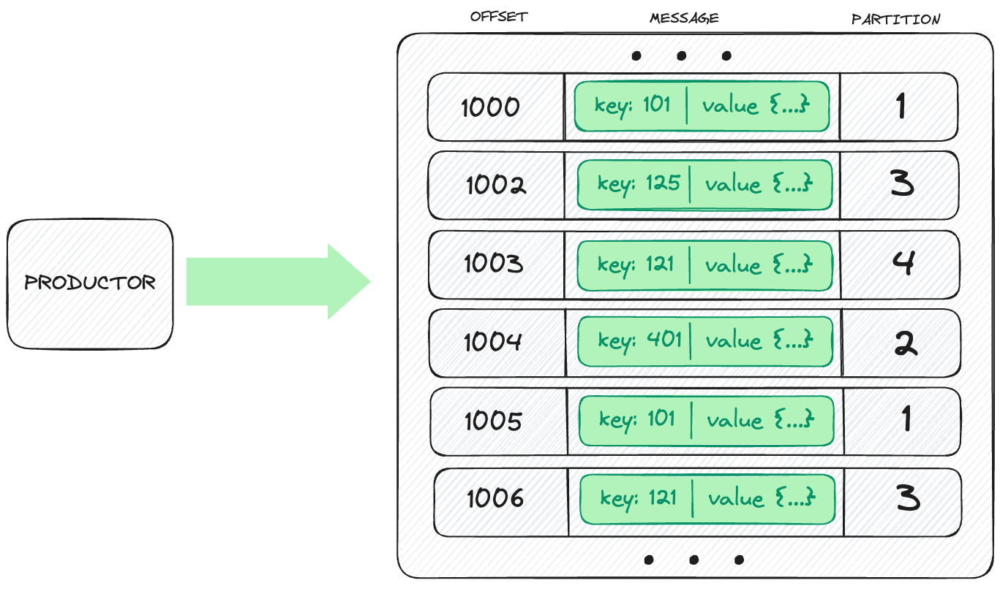
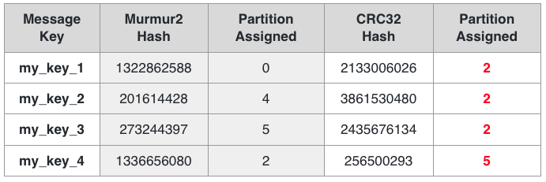
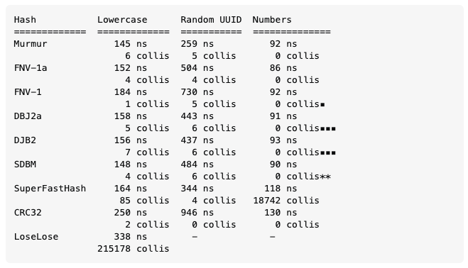

# CICLO DE VIDA DE LOS MENSAJES - PRODUCCIÓN

Los productores son los encargados de publicar los mensajes en los distintos topics y son los responsables de elegir a qué partición dentro del topic asignar un registro, esta tarea de asignación se puede hacer mediante algoritmos de balanceo

El particionado se puede realizar usando varias estrategias:
- RoundRobin partitioner: Los mensajes se envían de forma cíclica a cada partición.
- Default partitioner: Los mensajes se envían a particiones en función del hash de la key. Los mensajes con key nula, se envían usando RoundRobin.
- Custom partitioner: Este método implementa la interfaz *Partitioner* para sobreescribir el método *partition* con una lógica para la estrategia de selección de partición. 

Por otro lado, es muy importante conocer el algoritmo de hash utilizado, pues varía entre distintos lenguajes. 
Como ejemplo Java usa Murmur y Phthon usa CRC32.
Este aspecto es crítico ya que, como vemos en la siguiente tabla, algoritmos distintos pueden provocar que un mensaje con la misma key se envíe a una partición distinta:

Como curiosidad, una tabla con los tiempos medios de hash y el número de colisiones:

## [VOLVER](readme.md)