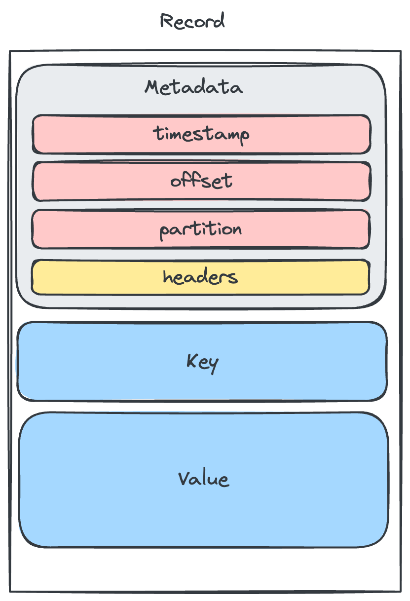

# Mensajes
Un mensaje de kafka es un registro que se compone de una clave, un valor y unos metadatos.

### Metadatos
Contiene datos relevantes para la gestión del mensaje como el timestamp, la partición y el offset entre otros. Adicionalmente también se pueden añadir cabeceras custom al mensaje como clave valor.

### Key
La clave del mensaje es opcional y se utiliza para determinar la partición a la que se enviará el mensaje. En general debaría ser un valor único o que permita agrupar mensajes relacionados.

### Value
El valor del mensaje es el contenido del mensaje. El formato es libre pero debería conocerse por parte de los consumidores para poder deserializarlo. Los formatos más comunes son JSON, AVRO, ProtoBuf o binario.

## [VOLVER](readme.md)