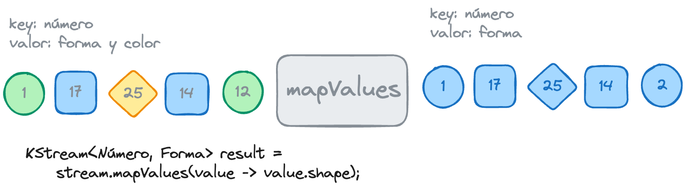
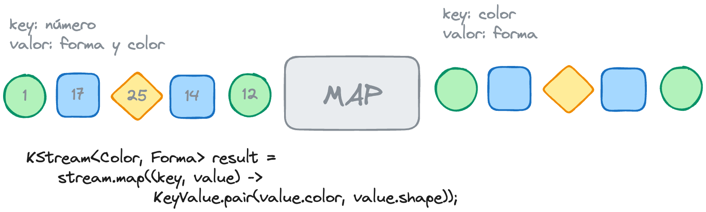
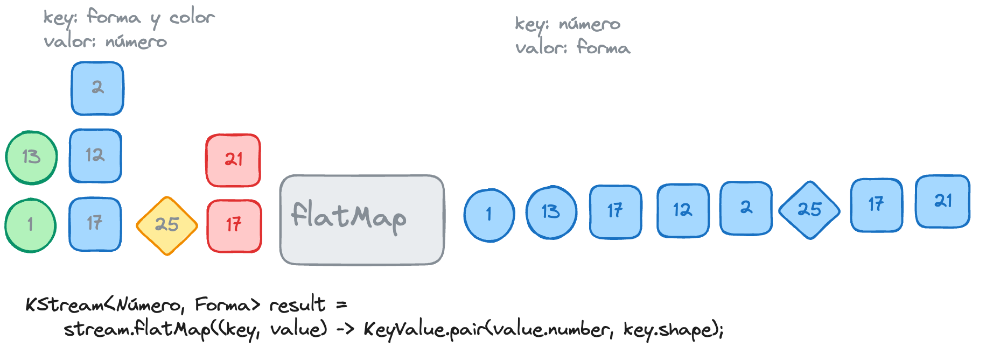
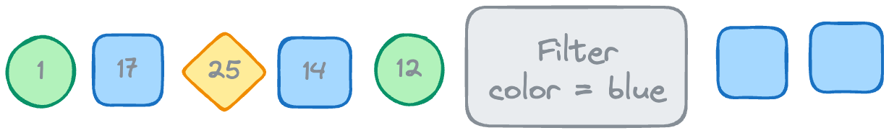
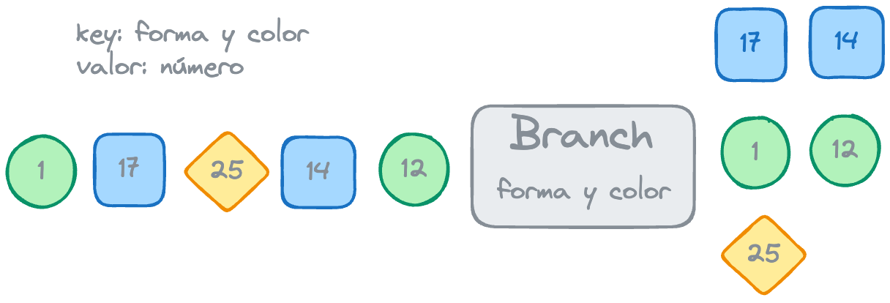
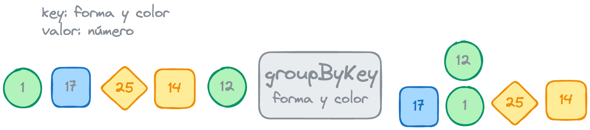
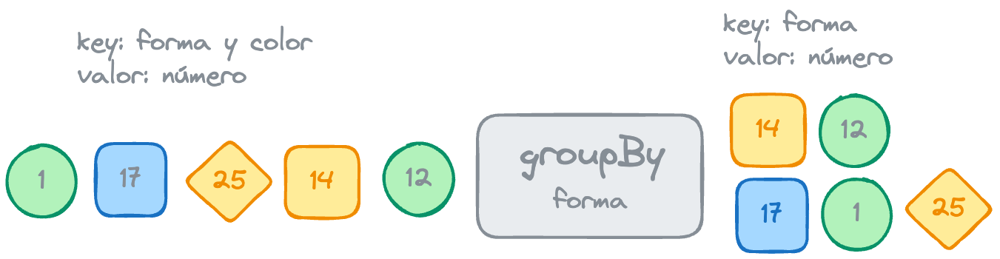

## OPERACIONES STATELESS

Las transformaciones sin estado no requieren conocer el estado actual de un elemento para realizar su procesado.
Las operaciones sin estado que provee el DSL de KStreams son:

### [mapValues](https://kafka.apache.org/11/javadoc/org/apache/kafka/streams/kstream/KStream.html#mapValues-org.apache.kafka.streams.kstream.ValueMapper-)

La operación mapValues, recibe un value como entrada y genera un nuevo value a la salida, sin modificar la key.

Retorna un KStream que contiene los registros con la misma clave y un valor fruto de la transformación.
La firma del método es la siguiente:
> <VR​> KStream<K,VR> mapValues(ValueMapper<? super V,? extends VR> mapper)

### [map](https://kafka.apache.org/11/javadoc/org/apache/kafka/streams/kstream/KStream.html#map-org.apache.kafka.streams.kstream.KeyValueMapper-)

La operación map, recibe una key y un value como entrada y puede usarlos para definir los mensajes de salida. 
> Esta operación implica un reparticionado en un tópico interno incluso aunque la key no cambie, por lo que es 
> computacionalmente más costosa. 

Retorna un KStream que contiene los registros con la nueva clave y valor fruto de la transformación.
La firma del método es la siguiente:
> <KR,VR> KStream<KR,VR> map(KeyValueMapper<? super K,? super V,? extends KeyValue<? extends KR,? extends VR>> mapper)

### [flatMap](https://kafka.apache.org/11/javadoc/org/apache/kafka/streams/kstream/KStream.html#flatMap-org.apache.kafka.streams.kstream.KeyValueMapper-)

Esta operación toma un registro y produce 0, 1 ó muchos registros.
Se pueden modificar las claves y los valores, incluyendo sus clases.

Al igual que el método map, este conlleva un reparticionado.

Devuelve un KStream que contiene más o menos registros con la nueva clave y valor.

La firma del método es la siguiente:
> KStream<K, V> result = stream.flatMap((<K0>key, <V0> value) -> KeyValue.pair(<K>key, <V>value)) 

### [flatMapValues](https://kafka.apache.org/11/javadoc/org/apache/kafka/streams/kstream/KStream.html#flatMapValues-org.apache.kafka.streams.kstream.ValueMapper-)

Al igual que mapValues, esta operación sólo cambia el valor del registro original, manteniendo la clave.
Devuelve un KStream que contiene más o menos registros, con los nuevos valores y la clave sin modificar.

La firma del método es la siguiente:
> <​VR> KStream<K,VR> flatMapValues(ValueMapper<? super V,? extends java.lang.Iterable<? extends ​VR>> mapper)

### [selectKey](https://kafka.apache.org/11/javadoc/org/apache/kafka/streams/kstream/KStream.html#selectKey-org.apache.kafka.streams.kstream.KeyValueMapper-)

Esta operación asigna una nueva clave (puede ser de otra clase) a cada registro. Al igual que todos los métodos que modifican la key, este método provoca un reparticionado, ya que una nueva key puede dar como resultado una redistribución de los registros en el tópico.
Devuelve un KStream que contiene el registro con la nueva clave y un valor sin modificar.

La firma del método es la siguiente:
> <K​R> KStream<​KR,V> selectKey(KeyValueMapper<? super K,? super V,? extends KR> mapper)

### [filter](https://kafka.apache.org/11/javadoc/org/apache/kafka/streams/kstream/KStream.html#filter-org.apache.kafka.streams.kstream.Predicate-)

Este método elimina los mensajes de un stream de entrada, que no cumplen una determinada condición.
Devuelve un KStream que contiene aquellos registros que cumplen un criterio.
Existe la variante filterNot, que realiza la operación contraria.

La firma del método es la siguiente:
> KStream<K,V> filter(Predicate<? super K,? super V> predicate)

> KStream<K,V> filterNot(Predicate<? super K,? super V> predicate)

### [branch](https://kafka.apache.org/28/javadoc/org/apache/kafka/streams/kstream/BranchedKStream.html#branch(org.apache.kafka.streams.kstream.Predicate))

Este método nos permite enrutar mensajes de un KStream a distintos KStreams, basado en predicados.
Cada mensaje es evaluado con los distintos predicados en el orden en el que se definen. En el momento en que un mensaje machea con un predicado, no se realiza ninguna otra evaluación y se enruta por esa rama.
El registro se descartará si no machea con ninguno de los predicados.
Retorna múltiples substreams del KStream.

La firma del método es la siguiente:
> BranchedKStream<K, V> branch(Predicate<? super K​,? super V> predicate)

### [peek]()

Este método proporciona una operación para cada evento del stream de entrada, pero deja el stream intacto.
Se utiliza para debugging, imprimiendo el contenido de mensajes, etc.
Retorna el mismo objeto.

### [forEach]()

Este método realiza una acción en cada mensaje de entrada. No retorna un stream. De hecho, no retorna nada.

### [groupByKey]()

Agrupa los registros por su clave y retorna un KGroupedStream que contiene los registros agrupados del KStream original.

### [groupBy](https://kafka.apache.org/28/javadoc/org/apache/kafka/streams/kstream/KTable.html#groupBy(org.apache.kafka.streams.kstream.KeyValueMapper,org.apache.kafka.streams.kstream.Grouped))

Agrupa los registros por una nueva clave, que puede ser de una clase distinta a la del KStream original.
Al igual que map y flatMap, marca el stream para un reparticionado.
Devuelve un KGroupedStream que contiene los registros del KStream original agrupados por la nueva clave.

La firma del método es la siguiente:
> <KR,​VR> KGroupedTable<KR,​VR> groupBy​(KeyValueMapper<? super K,​? super V,​KeyValue<KR,​VR>> selector, Grouped<KR,​VR> grouped)

> La agrupación es un prerrequisito para realizar el agregado de un stream o una tabla y garantiza que los datos están bien particionados para las siguientes operaciones. 

### [toStream](https://kafka.apache.org/28/javadoc/org/apache/kafka/streams/kstream/KTable.html#toStream())

Convierte un KTable en un KStream, o lo que es lo mismo, obtiene un changelog de la tabla.

### [repartition](https://kafka.apache.org/28/javadoc/org/apache/kafka/streams/kstream/KStream.html#repartition(org.apache.kafka.streams.kstream.Repartitioned))

Materializa un stream a un tópico auto-generado y crea un nuevo KStream desde el tópico auto-generado. Si no se usa la firma en la que se indica el número de particiones, mantendrá el número de particiones del tópico de origen.

## [VOLVER](kstreams)